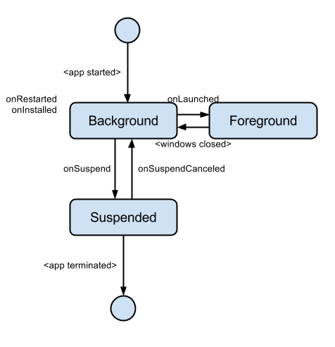
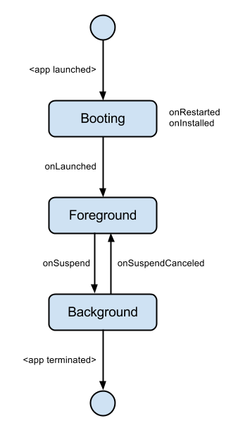

# Understanding Mobile Chrome Apps lifecycle events

## Lifecycle Events

In the Chrome Packaged App model, applications can be driven by several lifecycle events. These are fired as applications are launched and shut down, and in response to user actions like installing upgrades.

Understanding these can be critical to developing an application that can save and restore state effectively on a mobile device.

## The Events

onRestarted
onInstalled
onLaunched
onSuspend
onSuspendCanceled

## Desktop Event Firing Triggers and Sequence

On a desktop, Chrome fires lifecycle events as follows:

 * On startup, the application's background page starts.

 * *onRestarted* may be fired, if Chrome shut down abruptly. 

 * *onInstalled* may be fired, if the application was just installed or upgraded

 * When the application is launched, *onLaunched* is fired

 * When all foreground windows are closed, the application may be suspended.

 * When being suspended, *onSuspend* is fired.

 * If the application is brought back from suspend before being terminated, *onSuspendCanceled* is fired.

## Mobile Differences

On mobile, users generally don't "shut down" applications or close windows.

The OS does shut down applications, but users are usually unaware, since the applications are not visible at the time.

Applications (almost) never start without the intention of launching.

Applications generally do not run in the background. They are suspended instead, and can be terminated at any time.

## How Mobile Chrome Apps deals with this

### Startup

There are three events that can occur on startup:

 1. onRestarted -- this will only happen if the app shut down prematurely. This means that a previous onSuspend event *did not* run to completion.

 2. onInstalled -- this happens whenever the `manifest.json` version changes (including on first installation)

 3. onLaunched -- this currently happens always on startup, since applications are immediately launched.

These events will fire *after* your background scripts have run, so you should attach listeners for them.

If the app was not actually shut down, and is simply being brought back to the foreground, then only one event will fire:

 1. onSuspendCanceled

### Suspend / Resume

 * Every time the user switches away from the app, we fire onSuspend, because the OS could kill the app at any time.

 * If the user switches back before the OS terminates the app, we fire onSuspendCanceled.

 * It is the app's responsibility to save its state when onSuspend is called.

 * If the application is killed by the OS while the app is properly suspended, that's a clean shutdown. On relaunch we will just fire onLaunched.

 * If the application is killed by the OS before suspension is complete, then we will not fire onSuspendCanceled when it launches again; instead we fire onRestarted.
